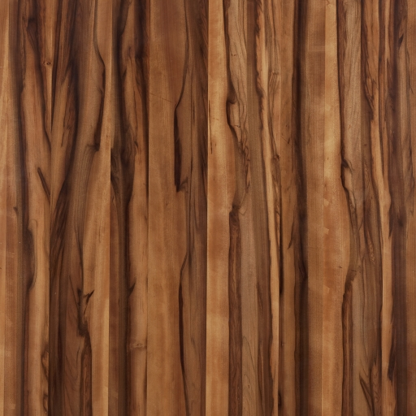
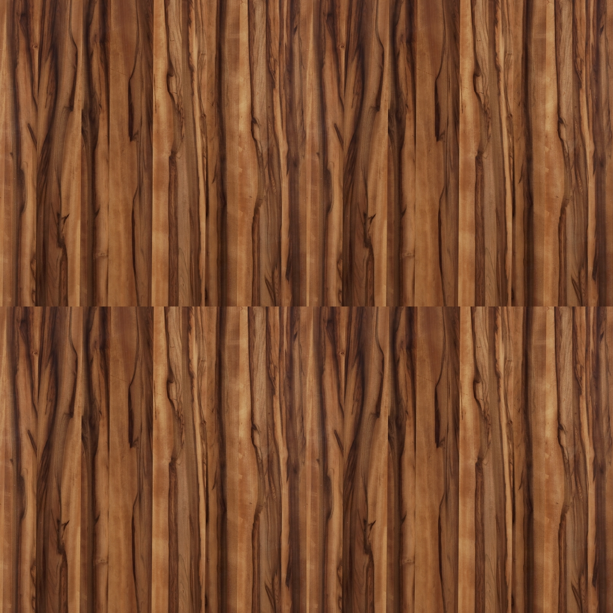

# 🎨 Texture reCreator

> A modern, high-performance online tool for testing and creating seamless texture patterns for 3D rendering

[](https://opensource.org/licenses/MIT)
[](https://vitejs.dev/)

## ✨ Features

- 🖼️ **Drag & Drop Interface** - Simply drag your texture image onto the page
- 🔄 **Two Tiling Patterns** - Standard tiling and mirror tiling for seamless textures
- 📐 **Adjustable Tile Size** - Control width and height independently or linked
- 🌓 **Dark Mode Support** - Automatic theme detection with manual toggle
- 📱 **Fully Responsive** - Works perfectly on desktop, tablet, and mobile
- ⚡ **Optimized Performance** - Web Workers and debouncing for smooth operation
- 💾 **Instant Download** - Export your tiled textures in high quality
- ♿ **Accessible** - ARIA labels and keyboard navigation support

## 🚀 Live Demo

Visit the live application: [https://akshaynikhare.github.io/Texture-reCreator/](https://akshaynikhare.github.io/Texture-reCreator/)

## 📸 Screenshots

### Light Mode
<p align="center">
  
  
</p>

### Tiling Patterns

**Standard Tiling**
<p align="center">
  
</p>

**Mirror Tiling** (for seamless textures)
<p align="center">
  
</p>

**Final Result**
<p align="center">
  
</p>

## 🎯 How It Works

Texture reCreator helps you test if your texture images will tile seamlessly in 3D applications:

1. **Upload Your Texture** - Drag and drop any image file
2. **Choose Pattern Type**:
   - **Standard**: Simple 2x2 grid repetition
   - **Mirror**: Flips edges to create seamless patterns
3. **Adjust Tile Size** - Use sliders to preview different tile sizes
4. **Download Result** - Save your perfectly tiled texture

The mirror tiling technique flips the image horizontally and vertically at the edges, eliminating visible seams when the texture repeats.

## 🛠️ Technology Stack

- **Build Tool**: [Vite](https://vitejs.dev/) - Lightning-fast build tool
- **JavaScript**: ES6+ modules with modern syntax
- **Canvas API**: HTML5 Canvas for texture manipulation
- **CSS**: Modern CSS with CSS Grid, Flexbox, and CSS Variables
- **Performance**: Web Workers for heavy operations
- **Architecture**: Modular, maintainable code structure

## 📦 Installation

### Prerequisites

- Node.js >= 18.0.0
- npm or yarn

### Local Development

```bash
# Clone the repository
git clone https://github.com/akshaynikhare/Texture-reCreator.git
cd Texture-reCreator

# Install dependencies
npm install

# Start development server
npm run dev

# Build for production
npm run build

# Preview production build
npm run preview
```

### Deployment to GitHub Pages

The project automatically deploys to GitHub Pages using GitHub Actions:

1. Push to the `main` or `master` branch
2. GitHub Actions builds the project
3. Built files are deployed to GitHub Pages
4. Site is live at `https://akshaynikhare.github.io/Texture-reCreator/`

See [Deployment Guide](docs/DEPLOYMENT.md) for detailed instructions.

## 📁 Project Structure

```
Texture-reCreator/
├── src/
│   ├── core/              # Core texture processing logic
│   │   ├── canvasRenderer.js
│   │   └── textureManager.js
│   ├── ui/                # UI components
│   │   ├── controls.js
│   │   ├── dragDrop.js
│   │   └── themeManager.js
│   ├── utils/             # Utility functions
│   │   ├── helpers.js
│   │   ├── imageLoader.js
│   │   └── performance.js
│   ├── workers/           # Web Workers
│   │   └── imageProcessor.worker.js
│   ├── styles/            # Stylesheets
│   │   ├── main.css
│   │   └── theme.css
│   └── main.js            # Application entry point
├── docs/                  # Documentation
├── assets/                # Image assets
├── index.html             # Main HTML file
├── package.json           # Dependencies
└── vite.config.js         # Vite configuration
```

## 📚 Documentation

- [Deployment Guide](docs/DEPLOYMENT.md) - GitHub Pages deployment instructions
- [Contributing Guide](docs/CONTRIBUTING.md) - How to contribute

## 🎨 Usage Examples

### Basic Usage

1. Open the application in your browser
2. Drag and drop a texture image onto the page
3. Choose between Standard or Mirror tiling
4. Adjust tile size using the sliders
5. Click the preview to download your texture

### Advanced Features

- **Link/Unlink Dimensions**: Click the chain icon to control width and height independently
- **Theme Toggle**: Click the theme button (top-right) to switch between light and dark modes
- **Keyboard Accessible**: Use Tab and arrow keys to navigate controls

## ⚡ Performance

- **Debounced Updates**: Slider changes are debounced to reduce unnecessary renders
- **Optimized Canvas**: Canvas operations are optimized for large images
- **Memory Management**: Automatic cleanup of object URLs and resources
- **Web Workers**: Heavy processing offloaded to background threads (when needed)

## 🌐 Browser Support

- Chrome/Edge (latest)
- Firefox (latest)
- Safari (latest)
- Opera (latest)

## 🤝 Contributing

Contributions are welcome! Please read our [Contributing Guide](docs/CONTRIBUTING.md) for details.

### Development Workflow

1. Fork the repository
2. Create a feature branch (`git checkout -b feature/amazing-feature`)
3. Make your changes
4. Run linting (`npm run lint`)
5. Commit your changes (`git commit -m 'Add amazing feature'`)
6. Push to the branch (`git push origin feature/amazing-feature`)
7. Open a Pull Request

## 📄 License

This project is licensed under the MIT License - see the LICENSE file for details.

## 👨‍💻 Author

**Akshay Nikhare**
- Website: [akshay-nikhare.appspot.com](http://akshay-nikhare.appspot.com/)
- GitHub: [@akshaynikhare](https://github.com/akshaynikhare)

## 🙏 Acknowledgments

- Thanks to all contributors who have helped improve this tool
- Inspired by the need for quick texture testing in 3D workflows
- Built with modern web technologies for optimal performance

## 📈 Changelog

### Version 2.0.0 (2025)

- ✨ Complete modernization with Vite build system
- 🎨 New modern UI with glassmorphism design
- 🌓 Dark mode support with theme persistence
- 📱 Fully responsive mobile-friendly layout
- ⚡ Performance optimizations (debouncing, memory management)
- ♿ Accessibility improvements (ARIA labels, keyboard navigation)
- 📦 Modular ES6+ codebase
- 📚 Comprehensive documentation
- 🎯 Better UX with loading states and error handling

### Version 1.0.0 (Original)

- Basic texture tiling functionality
- Standard and mirror tiling patterns
- Drag and drop support

---

<p align="center">Made with ❤️ for the 3D community</p>
