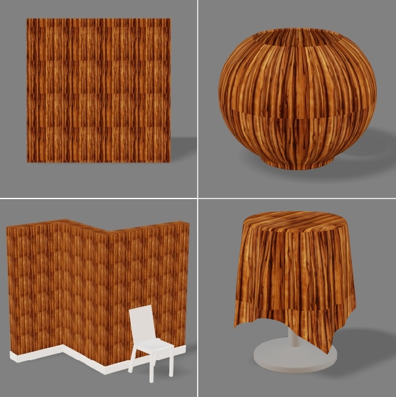
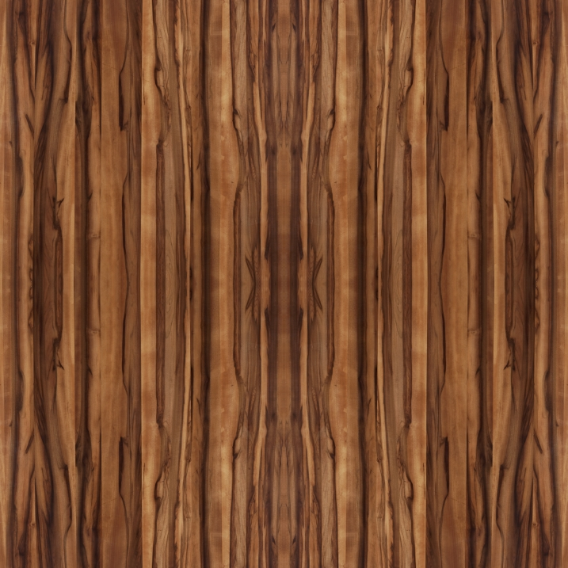

# Texture-reCreator
An online tool to check the image tileing while 3D rendering

an texure image on left will genrate an texure as on right

  
    

what we are doing here is we are takeing a image multplying it to four image like below and then applying to 3d model , this will not affect an good texure image. 

  

now the trick is we an also tile the images in non-linear patten like 
not affect an good texure image. 

  

which can genrate a pritty good sample when appled to 3D model, without any seam.

  

##  Usage

To use the porject go to
https://akshaynikhare.github.io/Texture-reCreator/.
