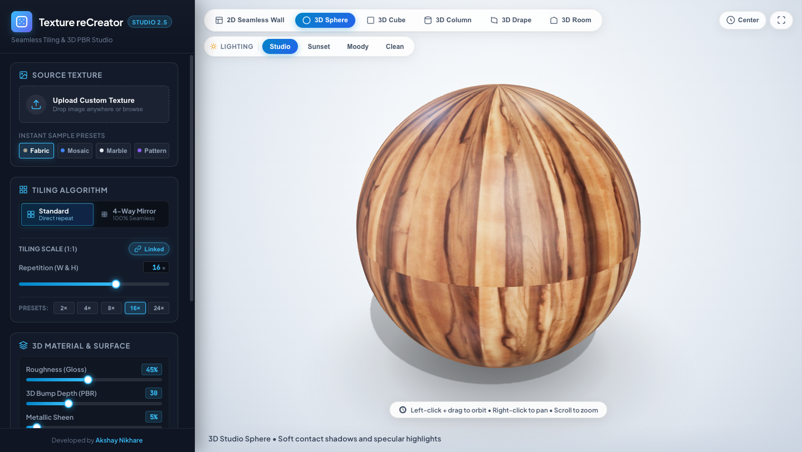
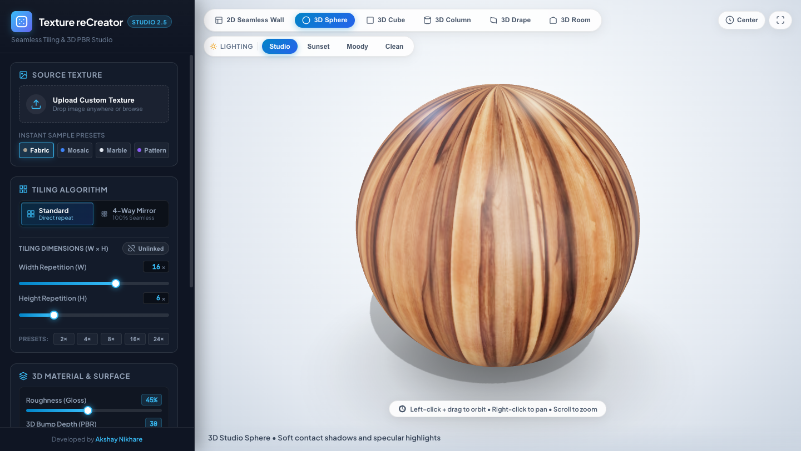
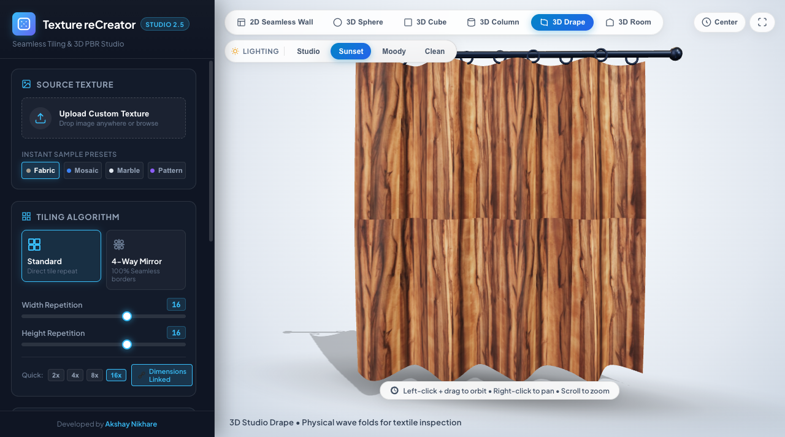
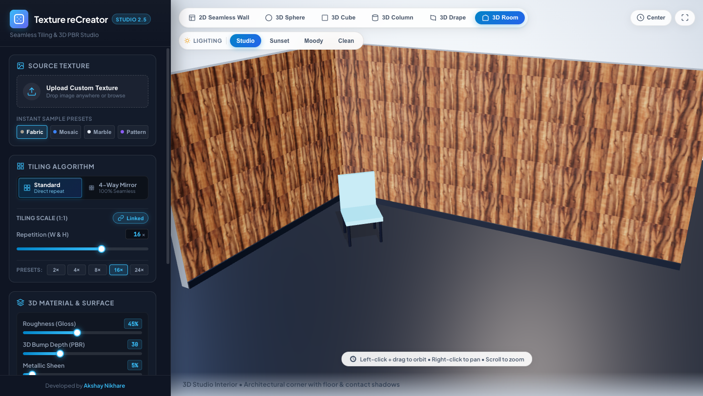
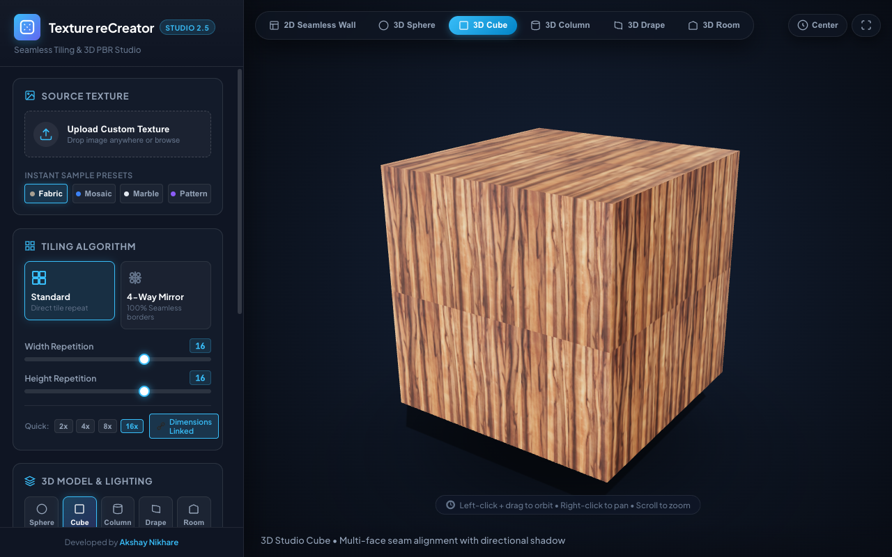
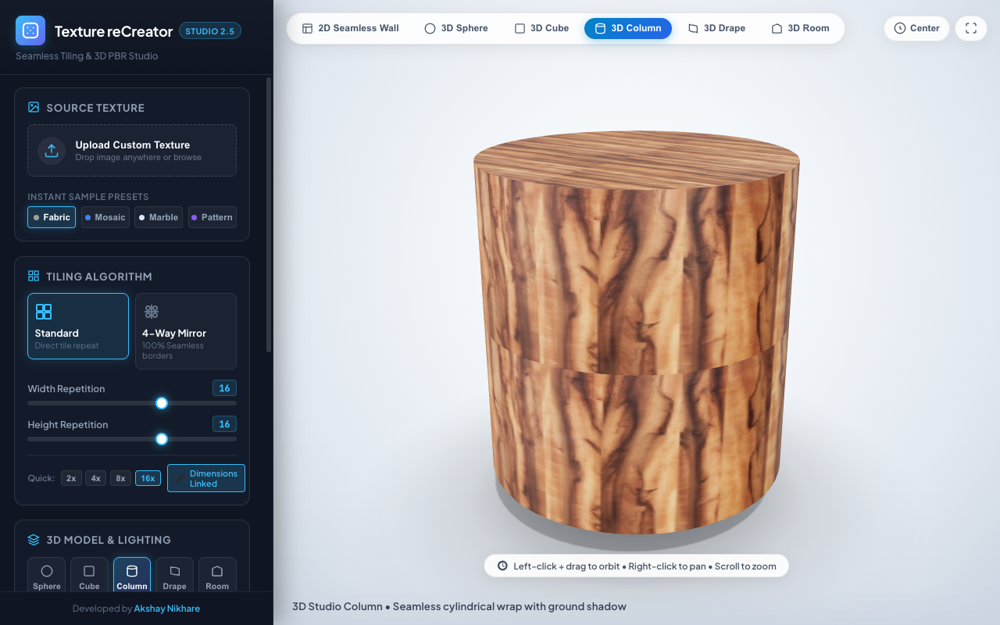

# 🎨 Texture reCreator • STUDIO 2.5

> A modern, high-performance online tool for creating seamless texture patterns and inspecting materials in real-time 3D PBR studio environments.

[](https://opensource.org/licenses/MIT)
[](https://threejs.org/)
[](https://vitejs.dev/)
[](https://akshaynikhare.github.io/Texture-reCreator/)

---

## 🚀 Live Demo

**Experience the studio live:**  
👉 **[https://akshaynikhare.github.io/Texture-reCreator/](https://akshaynikhare.github.io/Texture-reCreator/)**

---

## 📸 Studio Showcase

<p align="center">
  
</p>

---

## ✨ Key Features

### 🧊 1. High-Fidelity Three.js 3D PBR Studio
- **6 Inspection Geometries**:
  - **3D Sphere**: Smooth spherical mapping for testing curved reflection and specular highlights.
  - **3D Cube**: Hard surface bevels for checking edge continuity and seam alignment.
  - **3D Column**: Cylindrical wrap for checking vertical and circumferential tiling.
  - **3D Drape**: Realistic hanging textile with vertical accordion pleats, bottom ripples, hanging curtain rod, finials, and contact shadows.
  - **3D Room (150mm L-Shaped Wall)**: Architectural 150mm wall with seamless flush 90° corner, matte gray exterior/top/ends, and texture mapped exclusively to interior walls with slim baseboard skirting.
  - **2D Seamless Wall**: Flat plane aligned straight-on for orthographic texture review.
- **Permanent Photography Cyclorama**: Clean, daylight grayish-white studio backdrop with calibrated soft PCF directional shadows and ground ambient occlusion.
- **4 Studio Lighting Setups**: Quick-switch presets floating in the viewport (`Studio`, `Sunset`, `Moody`, `Clean`).
- **PBR Surface Shaders**: Real-time sliders for **Roughness (Gloss)**, **3D Bump Depth** (automatic procedural normal/bump generation), and **Metallic Sheen**.
- **Interactive Turntable**: Auto-rotate inspection with smart drag-to-stop detection and camera centering.

---

### 🎛️ 2. Photoshop-Style Dimension & Scale Controls
- **Proportional Constraint (1 Slider vs. 2 Sliders)**:
  - **Linked (`🔗 Linked`)**: Shows **1 single master slider** for uniform repetition (`Repetition (W & H)`), keeping the interface compact and clutter-free.
  - **Unlinked (`⛓ Unlinked`)**: Dynamically reveals **2 independent sliders** (`Width (W)` and `Height (H)`) for non-square aspect ratio scaling.
- **Precision Numeric Badges (Scrubby Inputs)**: Interactive number chips (`[ 16 ] ×`) with two-way binding — drag the slider or type an exact integer directly.
- **Active Slider Track Fill**: Dynamic CSS gradient fills tracking the slider thumb position.
- **Quick Preset Multipliers**: Fast-jump buttons (`2×`, `4×`, `8×`, `16×`, `24×`).
- **Segmented Tiling Algorithm Selector**: Compact pro tabs for switching between:
  - **Standard**: Direct tile repeat.
  - **4-Way Mirror**: Automatic edge mirroring for 100% seamless boundaries.

---

### 📤 3. Export & Workflow Integrations
- **Live Resolution Badge**: Displays tiled texture dimensions in real time (e.g. `512 × 512 px`).
- **Download Texture**: Save high-resolution seamless textures ready for Blender, Unreal Engine, Unity, Substance, or WebGL.
- **Copy to Clipboard**: One-click copy for pasting textures straight into Figma, Photoshop, or Slack.
- **3D Snap**: Instant high-resolution screenshot export from the 3D viewport.

---

## 🖼️ Gallery

| 1 Slider (Linked Mode) | 2 Sliders (Unlinked Mode) |
| :---: | :---: |
|  |  |

| 3D Drape (Textile Folds & Sunset Light) | 150mm L-Shaped Wall Room |
| :---: | :---: |
|  |  |

| 3D Cube (Edge Seams) | 3D Column (Cylinder Wrap) |
| :---: | :---: |
|  |  |

---

## 🛠️ Technology Stack

- **3D Rendering**: [Three.js](https://threejs.org/) (PCF soft shadows, PBR standard materials, environment mapping)
- **Build Tool**: [Vite](https://vitejs.dev/)
- **Core**: Vanilla JavaScript (ES6+ Modules), HTML5 Canvas API, Web Workers
- **Styling**: Vanilla CSS (Custom Design System, Glassmorphism, CSS Custom Properties)
- **Code Quality**: ESLint + Prettier

---

## 📦 Installation & Local Development

### Prerequisites
- Node.js >= 18.0.0
- npm or yarn

### Setup

```bash
# Clone the repository
git clone https://github.com/akshaynikhare/Texture-reCreator.git
cd Texture-reCreator

# Install dependencies
npm install

# Start Vite development server
npm run dev

# Run code linter
npm run lint

# Build production bundle
npm run build

# Preview production build locally
npm run preview
```

---

## 📁 Project Structure

```
Texture-reCreator/
├── src/
│   ├── core/                  # Core texture & canvas processing
│   │   ├── canvasRenderer.js  # 2D tiling & 4-way mirror algorithms
│   │   └── textureManager.js  # State orchestration & export pipeline
│   ├── ui/                    # UI controllers & 3D viewport
│   │   ├── controls.js        # Photoshop-style sliders, linking & inputs
│   │   ├── dragDrop.js        # Drag-and-drop file uploader
│   │   └── threePreview.js    # Three.js 3D scene, PBR shaders & models
│   ├── utils/                 # Utilities & helpers
│   │   ├── helpers.js         # Debounce & math helpers
│   │   ├── imageLoader.js     # Image loading & caching
│   │   └── performance.js     # FPS & performance monitoring
│   ├── workers/               # Web Workers
│   │   └── imageProcessor.worker.js # Multi-threaded canvas processing
│   ├── styles/                # Styling & design system
│   │   ├── main.css           # Core stylesheet & Photoshop studio theme
│   │   └── theme.css          # Design tokens & color system
│   └── main.js                # App entrypoint & URL state management
├── assets/                    # Static textures, environment maps & icons
│   ├── screenshots/           # High-resolution README showcases
│   └── env/                   # Studio lighting HDR / maps
├── docs/                      # Deployment & contributing guides
├── index.html                 # Main application markup
├── package.json               # Dependencies & scripts
└── vite.config.js             # Vite bundler configuration
```

---

## 🤝 Contributing

Contributions, issues, and feature requests are welcome!
Feel free to check out the [issues page](https://github.com/akshaynikhare/Texture-reCreator/issues).

---

## 📄 License

This project is licensed under the [MIT License](LICENSE).

Developed by [Akshay Nikhare](http://akshay-nikhare.appspot.com/)
